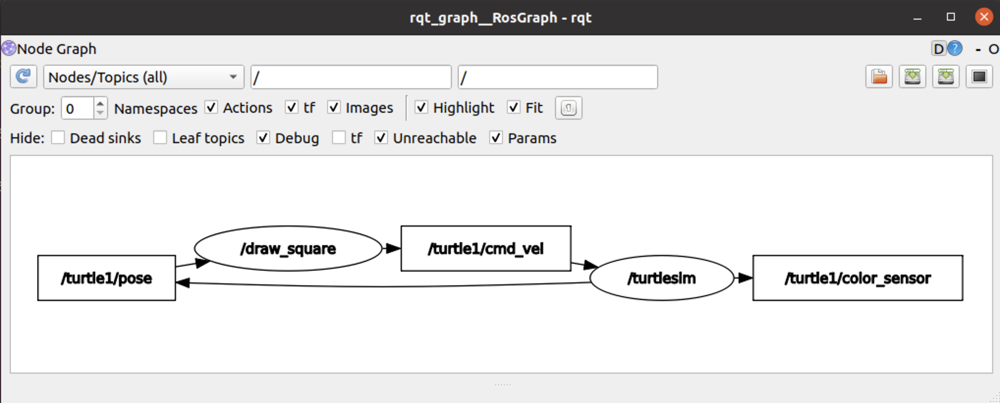

# ROS1Tutorials

## Start a ros node from terminal

to start ros master type : `roscore`
TO start Talker example you have to type :`rosrun rospy_tutorials talker`
To start listener: `rosrun rospy_tutorials listener`
TO show the graph of nodes type `rqt_graph`

try different nodes
Run with : `rosrun turtlesim  turtlesim_node`
To control it with keyboadr : `rosrun turtlesim  turtle_teleop_key`

## Create catkin_ws

* `cd ROS1Tutorials`
* `mkdir catkin_ws`
* `cd catkin_ws`
* `mkdir src`
* `catkin_make `

  If we go to the devel folder
* `cd devel/`
* and type `ls`

So you will se a folder name `setup.bash`. To use the code we written we have to source this setup.bash file.

To source it you can type `cd `than source `~/ROS1Tutorials/catkin_ws/devel/setup.bash`

Or add it to .bahrc file and source it(preffered)

* First go to home directory by typing `cd`.
* Add it to .bashrc using `gedit ~/.bashrc`
* Save and source .bashrc using   `source ~/.bashrc`

## Create a Ros Package

* Go to source folder `cd ~/ROS1Tutorials/catkin_ws/src`
* To create a package you have to write `catkin_create_pkg <package name> < dependecies>` in our case we will create like this `catkin_create_pkg my_robot_controller rospy turtlesim`
* Inside source my_robot_controller package is created. Inside it you can see CMakeLists.txt file this file help us to create excutables and compile code for C++ And with ROS it also help us to create custom ros messages
* Let's explain packae.xml you can take a look to default comments to add ad depend later you can it like `<exec_depend>turtlesim</exec_depend>`
* After any change you do you have to go the the workspace main folder directory here it is catkin_ws and build it using `catkin_make` command
* if you go inside build you will have to see a folder named my_robot_controller

## Write a ROS Node with Python

* Go to src file

  ```
  cd ~/ROS1Tutorials/catkin_ws/src/my_robot_controller/

  ```
* Create a file named scripts for our python scripts `mkdir scripts`
* Go to the direction created and make a new python file

  ```
  cd scripts
  touch my_first_node.py
  ```
* Let's make it excutable with this command

  ```
  chmod +x my_first_node.py
  ```
* Let's write a node in our python file
* You can install Cmake , python and ROS extensions in vscode
* run it with `python3 my_first_node.py`
* Because it is executable you can also run it `./my_first_node.py`
* Go to home directory with `cd` than run `rosrun my_robot_controller my_first_node.py`
* You can use `rosnode list` command to list ros nodes
* You can use `rosnode kill/<node_name>` for us it will be `rosnode kill /test_node`

  ## ROS Topic
* Run `roscore` if we run `rosrun rospy_tutorials talker` and `rosrun rospy_tutorials talker`
* `rostopic list` list your topics you will have the chatter topic you can see it also with `rqt_graph`
* To get info about the topic run `rostopic info /chatter` this will give you the following output

  ```
  Type: std_msgs/String

  Publishers: 
   * /talker_66445_1694860591067 (http://ubuntu:43059/)

  Subscribers: 
   * /listener_66698_1694860618145 (http://ubuntu:42305/)

  ```
* `rosmsg show std_msgs/String` the output of this command wiill be string data it is is the containt of it.
* To listen a topic and what is send to it `rostopic echo /chatter`


### Rostopic with turtlesim

* Run `rosrun turtlesim turtlesim_node`
* To draw square `rosrun turtlesim draw_square`
* run `rqt_graph` 
* `rostopic list`
* `rostopic info /turtle1/pose`
* Run `rosmsg show turtlesim/Pose` you will get output

  ```
  float32 x
  float32 y
  float32 theta
  float32 linear_velocity
  float32 angular_velocity
  ```
  This is the data inside the message
* To listen the topic `rostopic echo /turtle1/pose`
